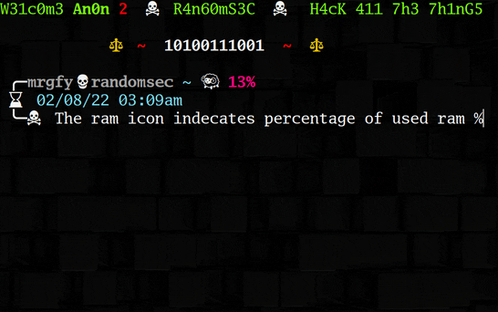
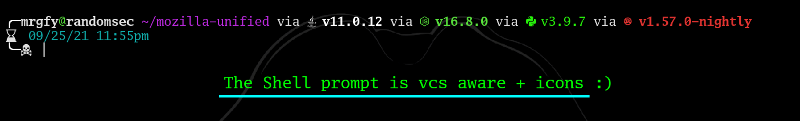
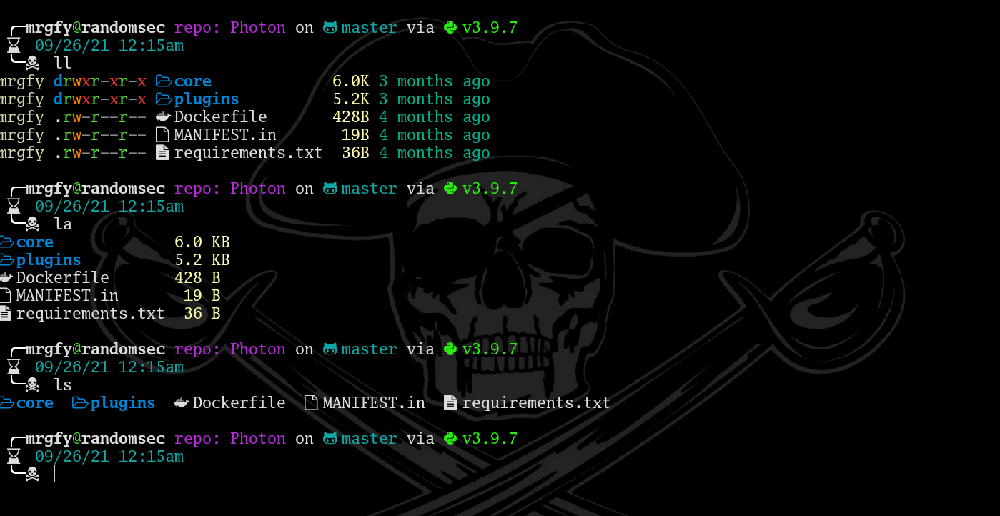

# Yarr Me Bash is a complete Linux bash shell prompt configuration and theme for Linux

## NOTE: Ricing is an Art. The more knowledgable you are, the better.
### Please review all files and test in a virtualized environment before making any changes to your main production machine.

> Yarr! Terminal go brrrrrrrrrrrrrrrrrrrrrrrrrrrrr!!!

* Just run the install.sh and set terminal font in your terminals gui settings & reboot.

## Installation

```bash
./install.sh
```

   or try

```
bash install.sh
```

* Please note: the bashrc has lsd aliased to ls and bat aliased to cat. So please go over the bashrc file and comment in/out what works for you before installing.
* Once finished. If any issues are present, just comment stuff out in the new .bashrc, feh might not set wallpapers correctly, do this manually.
* Also depending on the terminal you use, please set the font in the terminal settings. I preffer GoMono Nerd Font. Monospaced fonts have smaller icons.
* And don't forget to source your new .bashrc. Or logout and log back in.

```bash
. ~/.bashrc
```






## Enjoy
